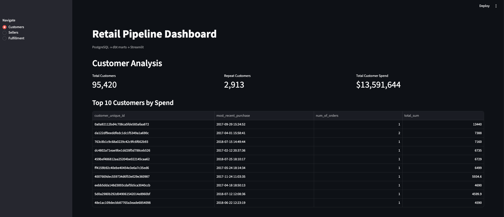

# Retail Data Pipeline

An end-to-end data engineering project built on the Olist Brazilian e-commerce dataset. Raw transactional data flows through an automated pipeline — ingested into PostgreSQL, transformed with dbt, orchestrated by Airflow, and surfaced in a Streamlit dashboard — producing analytics on customer behavior, seller performance, and order fulfillment.

Built to mirror how data moves in a real company: raw data in, clean insights out, running on a schedule without manual intervention.

---

## Architecture
Raw CSVs → Python Ingestion → PostgreSQL → dbt → Airflow → Streamlit

**Stack:**
- **Python** — ingestion script loading 9 Olist CSVs into PostgreSQL
- **PostgreSQL** — data warehouse running in Docker
- **dbt** — staging, intermediate, and mart models with data quality tests
- **Airflow** — DAG orchestrating the full pipeline on a daily schedule
- **Streamlit** — dashboard surfacing insights from the mart models
- **Docker** — containerizes PostgreSQL, pgAdmin, and Airflow

---

## Data Models

**Staging (9 models)** — clean and rename raw source tables, one per Olist entity (orders, customers, products, sellers, etc.)

**Intermediate (1 model)** — `int_orders_enriched`: joins order items, products, orders, and category translations into a single order-item level table used by all three marts.

**Marts (3 models):**
- `mart_customer_orders` — RFM analysis per customer: most recent purchase, number of orders, and total spend. Identifies highest-value customers.
- `mart_seller_performance` — revenue, average review score, and review count per seller, with location data. Identifies top-performing sellers by state and overall.
- `mart_order_fulfillment` — delivery status and timing per order. Tracks on-time vs late delivery rates and average days early/late.

**Tests (13)** — `unique`, `not_null`, `accepted_values` tests across all mart models enforcing data quality contracts.

---

## Dashboard

Three-section Streamlit dashboard querying mart models directly from PostgreSQL:
- **Customers** — total customers, repeat customers, total spend, top 10 by spend
- **Sellers** — total revenue, overall review score, top 10 sellers, revenue by state
- **Fulfillment** — on-time delivery rate, average days early/late, delivery performance breakdown



---

## How to Run

**Prerequisites:** Docker Desktop, Python 3.12

**1. Start the database:**
```bash
cd docker
docker compose up -d
```

**2. Load raw data:**
```bash
source retail_env/bin/activate
python ingestion/load_data.py
```

**3. Run dbt transformations:**
```bash
cd retail_transforms
dbt run
dbt test
```

**4. Start Airflow:**
```bash
cd airflow
docker compose up -d
```
Navigate to `localhost:8080` (username: `airflow`, password: `airflow`) and trigger the `retail_pipeline` DAG.

**5. Start the dashboard:**
```bash
streamlit run dashboard/dashboard.py
```
Navigate to `localhost:8501`.

---

## What I'd Do Next

- **Cloud deployment** — migrate PostgreSQL to AWS RDS, dbt to dbt Cloud, and Airflow to MWAA or Astronomer
- **Incremental loading** — replace full-refresh ingestion with incremental loads using dbt's incremental materialization
- **Cloud storage** — move raw CSV files to S3 so ingestion works from anywhere, not just locally
- **CI/CD** — run `dbt test` automatically on every GitHub push via GitHub Actions
- **Data visualization** — add Plotly charts and deeper drill-downs to the Streamlit dashboard

---

## Dataset

[Olist Brazilian E-Commerce Dataset](https://www.kaggle.com/datasets/olistbr/brazilian-ecommerce) — 100k orders from 2016–2018 across multiple Brazilian marketplaces.